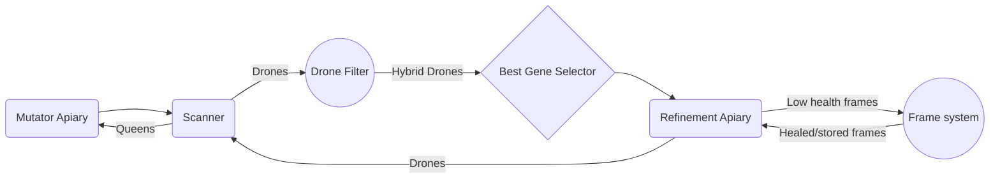

# Introduction

This is a ComputerCraft-based system for breeding hybrid bees in GregTech:New Horizons (GT:NH). This system relies on selective breeding in order to converge on the best possible genetics for the bees . 
This version was designed for use in HV, when you gain access to computers. 

# System Overview

This system is designed to cover all of the aspects of breeding a new hybrid species and thus has a lot of systems for different. 

```Mutator Apiary:``` This section breeds the types of bees in order to create hybrids of the desired species. This part inserts new genes into the system so that the hybrid type can be created. 
```Scanner:``` This section scans the bees so that their traits can be read to determine genetic value and whether or not the drones are hybrid.
```Drone Filter:``` This section sends queens back to their respective section in the mutator and picks out hybrid drones
```Best Gene Selector:``` This section chooses the highest quality genes from the inventory of drones and then pairs it with the princess and sends it to the refinement apiary
```Refinement Apiary:``` This breeds the bees and sends the mutated drones back to be scanned, where they will then re-enter the genepool.
```Frame System:``` This section manages the frames that are being used in the Refinement Apiary, removing low health frames and replacing them with new ones. This drastically speeds up the time that breeding takes when you use Oblivion frames.

# Usage

```AIpiary.lua``` runs the whole system, you will need to set some of the addresses for the transposers and 

### Arguments
The program has 4 arguments, 3 of which are required

``targetType``: The type of the first bee type that is being used for breeding. For breeding Windy bees this would be written as "Windy"
``firstQueenType``: The type of the first bee type that is being used for breeding. For breeding Windy bees this would either be "Supernatural" or "Ethereal" (Supernatural bees + Ethereal bees = Windy bees)
``secondQueenType``: The type of the second bee type that is being used for breeding. For breeding Windy bees this would either be "Supernatural" or "Ethereal" 
``effect``: The desired effect on the resulting bee, the system will prioritize breeding bees that have this type. default: "None"


## System Setup
This video goes over all of the parts of the system  in-depth.

[](https://youtu.be/KSrcwvrrfcc?si=Fo8rvJ5OF9nfvns5)


# Future Improvements
As of right now, this system requires a person to insert the bees. In the future I would like to do a segment for automatic searching for bees that have not yet been breeded and have the system breed those bees autonomously. That would require another system that can house a database of bees which is something that is possible in the modpack.

Some code could also be rewritten for clarity. Currently, all of the instructions for transposer moves are based on the setup that I have in my world, writing a function to easily change the directions of the system would make the setup easier.
